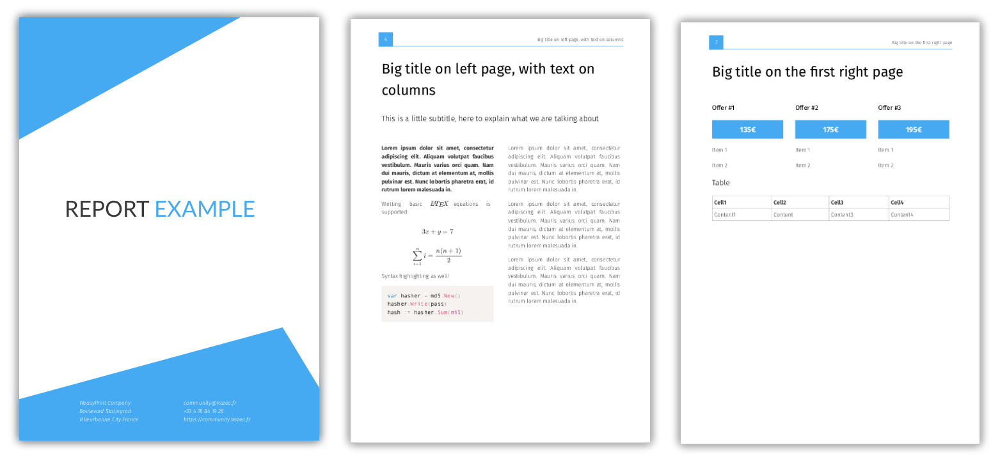
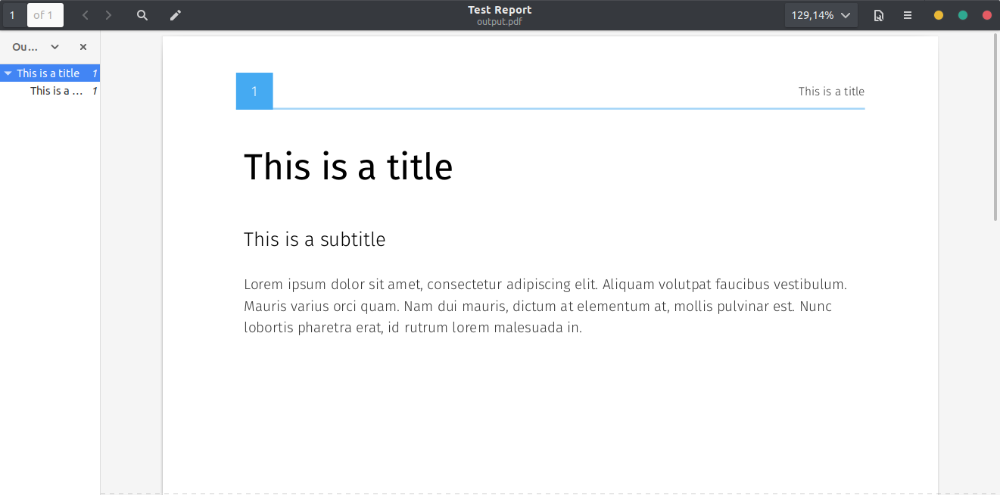

# MarkReport

This little script seamlessly converts Markdown to elegant PDF reports.



* Configurable report layout
* Automatic Table Of Content
* LaTeX equations
* Syntax highlighting
* Resizable images

## How does it work?

_MarkReport_ takes a markdown file, converts it to HTML (using Go's excellent [blackfriday](https://github.com/russross/blackfriday) package), renders LaTeX equations and code highlighting with JavaScript thanks to [Selenium](https://github.com/SeleniumHQ/selenium) and finally converts the enriched HTML to PDF thanks to [WeasyPrint](https://weasyprint.org/).

## How to use it?

Just type in your document as a Markdown `.md` file, using special syntax in comments to tell MarkReport how exactly the final PDF should be structured.

You may also split your document into several Markdown files, by specifying the order in which to compile these files in a `content.txt` in the main folder.

For instance :

    body.md
    conclusion.md
    content.txt
    intro.md

With `content.txt` :

    intro
    body
    conclusion

### Simple example

Let's take the following example:

```md
<!-- title Test Report -->

## This is a title

### This is a subtitle

<!-- section -->

Lorem ipsum dolor sit amet, consectetur adipiscing elit. Aliquam volutpat faucibus vestibulum.
Mauris varius orci quam. Nam dui mauris, dictum at elementum at, mollis pulvinar est.
Nunc lobortis pharetra erat, id rutrum lorem malesuada in.

<!-- !section -->
```

Open the folder in which the Markdown file above is located. Then run _MarkReport_:

    cd /path/to/markdown/file
    /path/to/MarkReport/MarkReport.py

The build process completes after a few seconds, and a `output.pdf` file appears in the folder.



### With a cover and a Table of Contents

```md
<!-- title My Report Title -->
<!-- cover cover.svg -->

# Title</br> <span style="font-size:40px">Smaller part</span> </br> <span class="doc-color">Colored part</span>

John Doe
Designer

john.doe@my-company.fr
+33 6 01 01 01 01
https://john-doe.io

<!-- !cover -->

<!-- toc Table of Contents -->

<!-- columns -->

## This is a title

### This is a subtitle

<!-- section -->

Lorem ipsum dolor sit amet, consectetur adipiscing elit. Aliquam volutpat faucibus vestibulum.
Mauris varius orci quam. Nam dui mauris, dictum at elementum at, mollis pulvinar est.
Nunc lobortis pharetra erat, id rutrum lorem malesuada in.

<!-- !section -->

<!-- !columns -->
```

See the `example` folder for a more detailed demonstration of what _MarkReport_ can achieve.

### Available layout commands

These commands will help you structure your document's layout. They are inserted as comments in the markdown source file.

The title of the documents (meta property):

    <!-- title My Title -->

The document's cover, including a title `Title` and some informations (`Infos`) at the bottom of the page:

    <!-- cover cover.svg -->
    # Title
    Infos
    <!-- !cover -->`

Insert an auto-generated table of contents:

    <!-- toc Table of contents -->

The content of the `sections`' inside will be displayed as regular full-width text:

    <!-- text -->
    ...
    <!-- !text -->

The content of the `sections`' inside will be displayed in a two columns fashion:

    <!-- columns -->
    ...
    <!-- !columns -->

Encapsulates some content:

    <!-- section -->
    <!-- !section -->

First paragraph written in bold:

    <!-- section-bold -->
    <!-- !section -->

Full page colored background marking the beginning of a new chapter:

    <!-- chapter -->
    <!-- !chapter -->

Vertical list of paragraphs with clear header text:

    <!-- items -->
    ...
    <!-- !items -->

Horizontal list of offers, with clear titles:

    <!-- offers -->
    ...
    <!-- !offers -->

List of paragraphs with their content indented:

    <!-- specs -->
    ...
    <!-- !specs -->


### Available command line flags

* `--basic` Javascript interpreter is disabled, allowing faster builds but without syntax highlighting or LaTeX support
* `--watch` The _MarkReport_ script will not stop after the first build, but stay idle and will rebuild t
as soon as a change is made in the current folder, allowing for faster hot-builds
* `--quiet` No output will be displayed during the build process

## Installation instructions

Some Python packages are needed to run the program. It's easy to get them with pip3:

    pip3 install weasyprint
    pip3 install pyinotify
    pip3 install selenium

Compilation of md-parsing

    export GOPATH=~/.go
    go get gopkg.in/russross/blackfriday.v2
    go get gopkg.in/yaml.v2
    go build -i md-parsing.go

The firefox driver is used to interpret JavaScript inside the HTML page generated from Markdown. You need to grab `geckodriver` in order to make it work:

    wget https://github.com/mozilla/geckodriver/releases/download/v0.24.0/geckodriver-v0.24.0-linux64.tar.gz
    tar -xvzf geckodriver*
    sudo mv geckodriver /usr/local/bin/

You're now ready to go.
